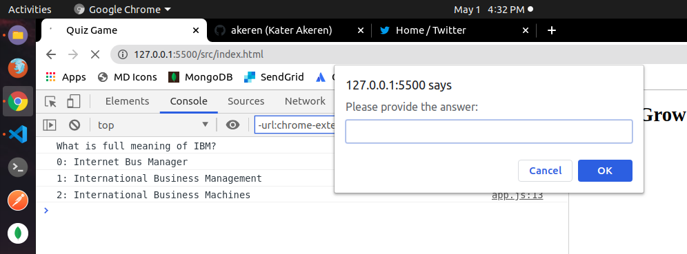
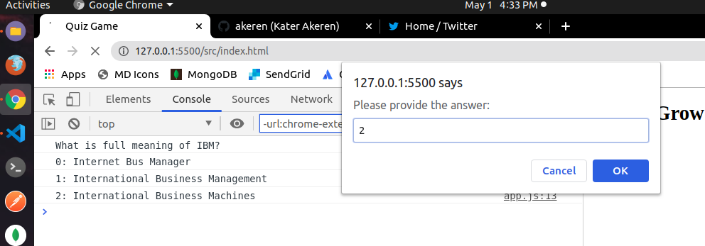
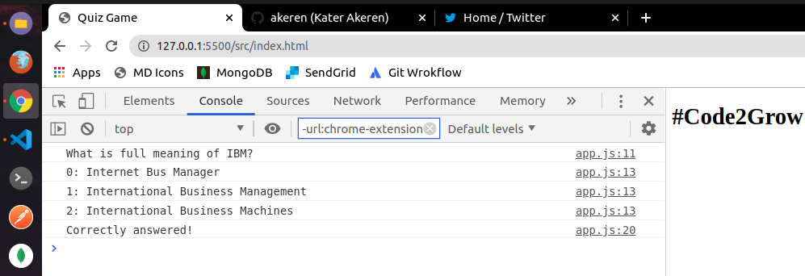

# GDG Gwagwalada #Code2Grow 10 Days of Code: JavaScript Console Quiz-App

The core idea behind this development is to help code newbies to understand the fundamental concept of building applications with a deep understanding of some data structures, objects, logical & structural thinking, and best practices among others during **[GDG Gwagwalada](https://twitter.com/GDGGwags) 10Days of Code** in isolation tag #Code2Grow.

## Topic Covered

- Variable Declarations
- Functions
- Arrays
- Objects
- Iheritances
- Closures
- JS Module Pattern
- ES5, ES6, ES7, ES8 to ESNext

## Demo

## Dev Guidelines

- I put together a development guidelines located in >Dev-guidelines directory

## Contributions

You can fork the repository and send pull request or reach out easily to me via twitter => [Kater Akeren](https://twitter.com/katerakeren)
